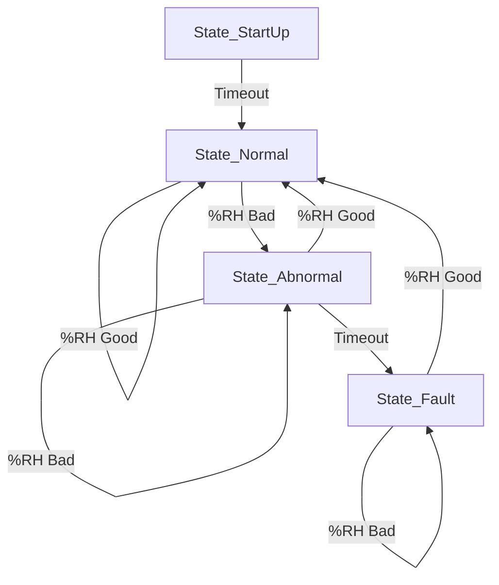

# Mella Smart Mushroom Fruiting Chamber - [Future Updates]

This is a fork of the original [Mella Smart Mushroom Fruiting Chamber by FirstBuild](https://github.com/FirstBuild/MellaMushroomChamber). This repository includes original work from FirstBuild as well as new, independent additions.

## Licensing

This repository contains code and designs from the original FirstBuild project as well as new contributions. It operates under a dual-license model:

*   **Original Work:** The original designs, software, and information from FirstBuild are provided under a specific non-commercial covenant. You may only use them for personal, non-commercial, or non-profit educational purposes. See [LICENSE-FIRSTBUILD.txt](LICENSE-FIRSTBUILD.txt) for the full terms.

*   **New Contributions to this Fork:** Licensed under **CC BY-NC 4.0**. See [LICENSE](LICENSE). 

Please review both license files before using any content from this repository.

**IMPORTANT:** Due to the restrictions of the original license, the **entire combined project** in this repository is subject to the **non-commercial use restriction**. You may not use this project for any commercial purpose.

## UPDATES

### Version 99.0.14 (Released October 11, 2025)
   These are first round software updates without modification to any hardware. A section was added to the top of the Parameters.h file to give you high level controls for new features.  Below are explanations of the new features and the parameters in this file to control them.

   LIGHTING: 
      A Timer was added to turn on an off the lights within a 24hr period.  The timer starts or when the lights knob it turned from zero to any setting. The knob setting still controls the brightness only. A parameter controls if the abnormal state flashing lights will occur.
      
         PARAMETER_LIGHTS_MODE - will enable or disable this feature (default: Enabled)
         PARAMETER_LIGHTS_HOURS_ON - controls the number of hours the light will remain on before turning off for the rest of the 24hr period (default: 12 hours)
         PARAMETER_STATE_MODE - allows the system to ignore an abnormal humidity condition and avoid flashing the lights (default: IGNORE)

   HUMIDITY: 
      This is the main issue people complain about, and this first round of updates may not improve maximum humidity but can reduce wind burn issues (I noticed on lion's mane). First maximum fan speed was reduced 50% in all modes.  Experimentally this achieved a 1-2% increase in RH while reducing windburn on lion's mane. Second was the creation of a duty cycle mode which cycles the humidifier on and off within a 10min period (configurable) based on the duty cycle % selected with the humidity control knob. This mode ignores the RH sensor. Third was to configure what type of signals were being sent to the humidifier device. This was added to bypass the PWM timing issues to be able to control a fogger (should be done with testing by Jan 2026). FAN mode sets up the output pin for PWM signals as originally shipped, FOG mode sets up the output pin for simple HIGH/LOW signals to give the full 12v or nothing.
         
         PARAMETER_HUMIDITY_MODE - Determines if the humidity sensor is controlling the system or a duty cycle (default SENSOR)
          PARAMETER_HUMIDITY_MAX_DUTY_CYCLE - determine the max duty cycle mapped to the control knob, this can be used for finer tuning (default 100)              
         PARAMETER_HUMIDITY_DEVICE - Determines if the output pin is set up for a FAN(pwm) or a constant voltage FOGGER(io) (default FAN)
         PARAMETER_HUMIDITY_WIND_REGULATOR - Lowers the max speed of the FAN whether in SENSOR mode or Duty Cycle Mode.  This float is the fraction of the true max speed, i.e. 0.42 is 42% of the max analog output. Change this to 1 if you would like the fan to run at full blast as shipped. (default 0.42)

   BUG FIXES: 
      Serial communication ended when the AirExchangeController.cpp duty cycle period ended, this may be because of a conflict with the timer.  I switched this to be based on millis() and have not had issues with serial communication.  By default, the system uses a 100% duty cycle anyway.

   KNOWN ISSUES:  
      There is a drift in the 24hr lighting timer which will vary with temperature of the crystal on the microcontroller.  Experimentally, I measured about 30 minutes over 7 days, future updates may include use of the external oscillator to address this.  

## Software Structure
The software is made up of a few main components/modules:

### Unit State
The primary purpose of this state machine is to maintain the system status.

Upon startup, the State Machine enters `State_Startup` for a parametrically-defined time. After startup, the unit enters `State_Normal`. While in this state, the humidity is periodically checked. If the humidity value falls outside the parametrically-defined range, the unit will enter `State_Abnormal` and remain in that state until the humidity returns to the normal range or a parametrically-defined timeout occurs. If the timeout occurs, the unit will enter `State_Fault`. While in this state, the lighting will be set to Error Mode. If the humidity re-enters the normal range, the unit will immediately return to `State_Normal`.

### Air Exchange Controller
This controller simply controls the fresh air exchange fan in accordance with the knob setting. In a future update, the fan will be set to only run for a parametrically-defined period of time.

### Humidity Controller
Mella uses a SHT31 temperature/humidity sensor for closed loop control. Measurements from the sensor are fed back into a parametrically-defined PID loop whose output controls the humidity fan.

During operation, the humidity controller will periodically measure relative humidity and control the humidity fan in an attempt to maintain the humidity setpoint defined by the encoder knob position. The Humidity Controller is responsible for determining if the humidity falls within the parametrically-defined normal range.

### Light Controller
The light controller handles the lighting modes and animations. The state machine will request either Error Mode or Normal Mode. Based on this request, the light controller will adjust how it controls both the chamber light as well as the PCB heartbeat LED. In Normal Mode, the chamber lights will remain on and the intensity will be set based on the encoder position. The heartbeat LED will blink in 1 second intervals. In Error Mode, the chamber lights will slowly pulsate/bounce to notify the user of an issue. Additionally, the heartbeat LED will begin blinking ten times per second.

### Encoders
All three controllers (Air Exchange, Humidity, and Light) get their setpoint from the user via a set of three 16-position absolute encoders.
The knob being in the 6 o'clock position equates to off. The remaining 15 positions represent equally spaced values from the minimum to maximum values for the respective controllers.

## Logging
Mella provides periodic logging of data in CSV format. When logging occurs, the output of each module is printed to the output. This log can be accessed via the Mini USB port as a serial UART with a baud rate of 115200.

## Building
This project uses PlatformIO and can be built using the PlatformIO build function.

## Programming
For programming, it is recommended that you use the AVRISP mkII programmer or similar. There is a 6-pin programming header (J24) on the PCB under the control knob cover. The 6-pin programming cable can be plugged directly into this header with the red wire on the programming cable (pin 1) toward back of the Mella. Note: the PCB needs DC power for programming to work.

